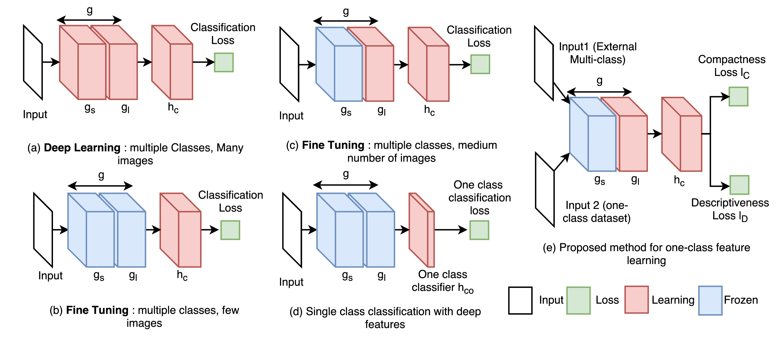

## Learning Deep Features for One-Class Classification

## Architecture

## Reference
[1] Dong Gong et al. (2019). <a href="https://arxiv.org/abs/1801.05365">Learning Deep Features for One-Class Classification</a>. IEEE Transactions on Image Processing 28.11 (2019): 5450-5463

[github](https://github.com/PINTO0309/Keras-OneClassAnomalyDetection)