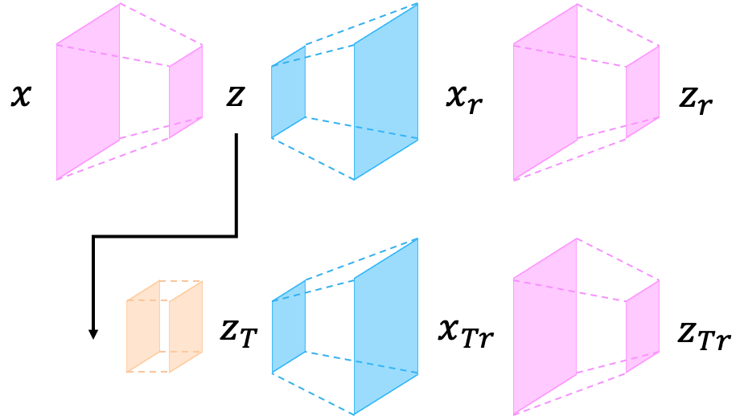

## Memorizing Normality to Detect Anomaly: Memory-augmented Deep Autoencoder for Unsupervised Anomaly Detection.

## Architecture

## Reference
[1] Wang, Xuhong, et al. <a href="https://www.sciencedirect.com/science/article/pii/S0950705119305283">Advae: a self-adversarial variational autoencoder with gaussian anomaly prior knowledge for anomaly detection.</a>. Knowledge-Based Systems 190 (2020): 105187.

 "" 