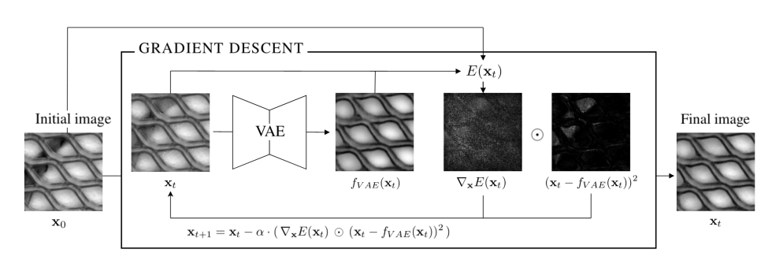
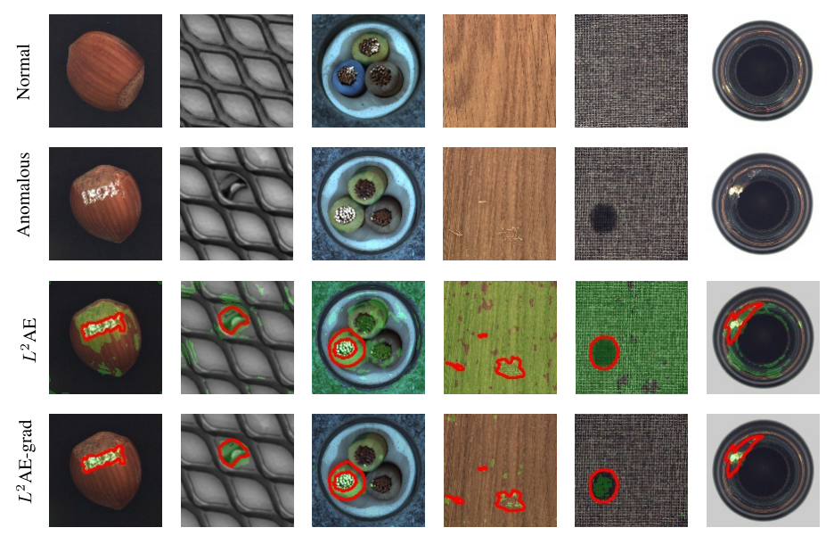
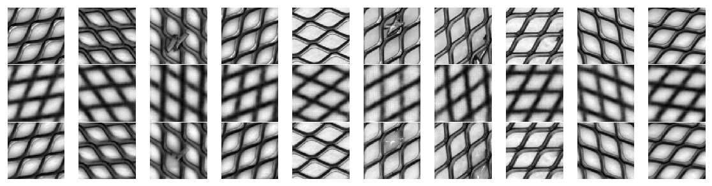

## Iterative energy-based projection on a normal data manifold for anomaly localization

## Architecture

## Result

## Reference
[1] Dehaene, David, et al. <a href="https://openreview.net/forum?id=HJx81ySKwr">Iterative energy-based projection on a normal data manifold for anomaly localization</a>. arXiv preprint arXiv:2002.03734 (2020).

reference:https://qiita.com/kogepan102/items/122b2862ad5a51180656