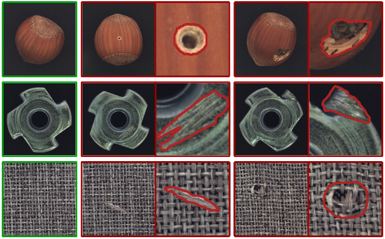

## MVTec AD--A Comprehensive Real-World Dataset for Unsupervised Anomaly Detection

## Presentation

## Reference
[1] Bergmann, Paul, et al. <a href="http://openaccess.thecvf.com/content_CVPR_2019/html/Bergmann_MVTec_AD_--_A_Comprehensive_Real-World_Dataset_for_Unsupervised_Anomaly_CVPR_2019_paper.html">MVTec AD--A Comprehensive Real-World Dataset for Unsupervised Anomaly Detection</a>. Proceedings of the IEEE Conference on Computer Vision and Pattern Recognition. 2019.
