异常检测在图像领域困难点

1、维度灾难：图像维度高，传统机器学习领域方法无法有效应对维度灾难问题。

2、特征表征：图像特征包含较高得语义信息，在无监督信息下无法有效得提取，同时还得保持特征空间一致性。

3、理论困乏：目前针对图像领域，缺乏有效手段界定Anomaly Score。

思考点：
1、目前纯无监督学习，无法做到异常检测。参见[Anomaly Detection in Images](http://arxiv.org/pdf/1905.13147v1.pdf)

数据集：
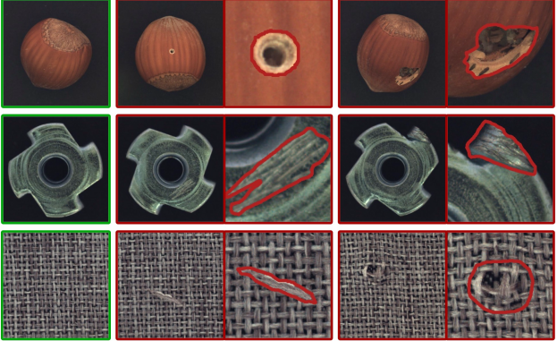
参见[MVTec AD--A Comprehensive Real-World Dataset for Unsupervised Anomaly Detection](http://openaccess.thecvf.com/content_CVPR_2019/papers/Bergmann_MVTec_AD_--_A_Comprehensive_Real-World_Dataset_for_Unsupervised_Anomaly_CVPR_2019_paper.pdf)

有效解决方案：

1、基于 student–teacher learning with Discriminative Latent Embeddings方式。参见[Uninformed Students: Student-Teacher Anomaly Detection with Discriminative Latent Embeddings](http://arxiv.org/pdf/1911.02357v1.pdf)
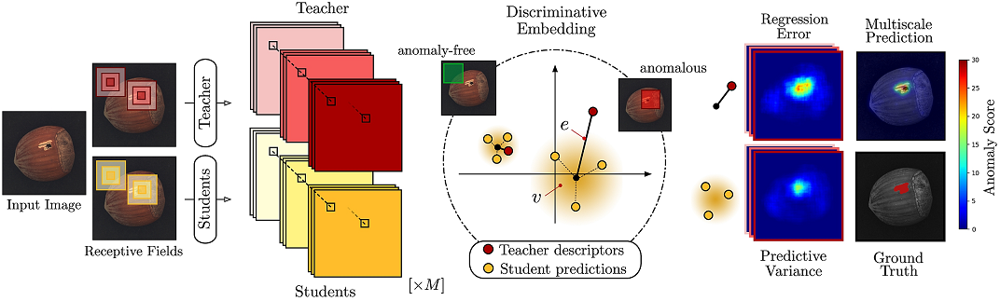
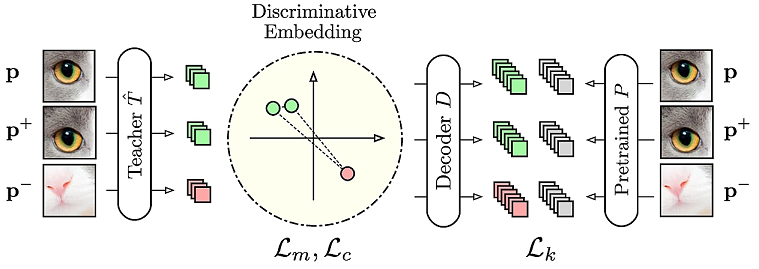

采用了度量学习方式，同时基于student–teacher网络在特征空间上对每个feature元素做密集回归的方式，学习异常分布。

2、基于迭代的能量优化模型 参见[Iterative energy-based projection on a normal data manifold for anomaly localization](https://openreview.net/pdf?id=HJx81ySKwr)
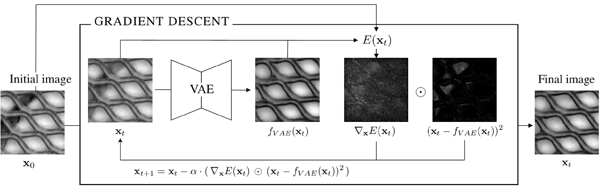

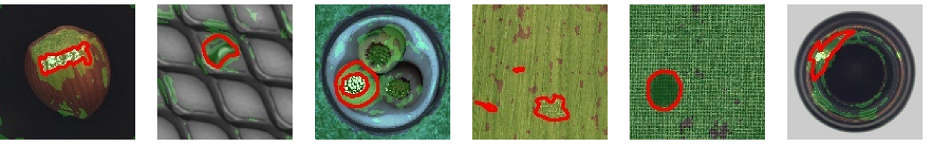
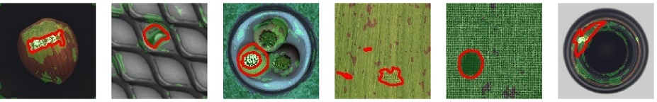
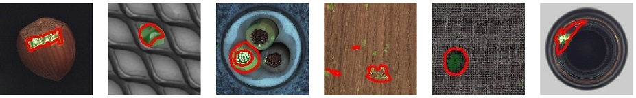

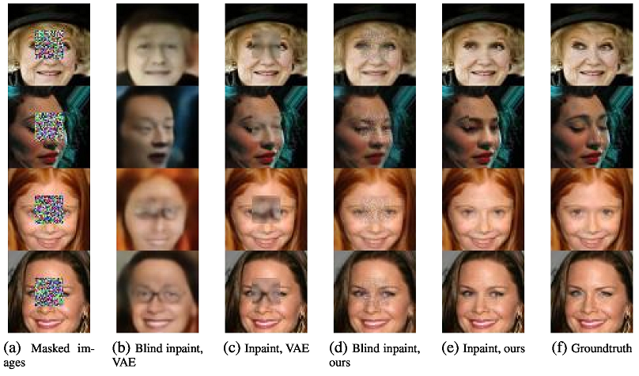

以梯度迭代优化的思想，构建能量优化函数，循环迭代，恢复正常流形空间。借鉴了图像修复的思想。

3、基于Memory-augmented思想 构建Autoencoder。使得恢复图像是由正常样本embedding组合而成，避免了恢复出异常图像的可能性。参见[Memorizing Normality to Detect Anomaly: Memory-augmented Deep Autoencoder for Unsupervised Anomaly Detection](http://arxiv.org/pdf/1904.02639v1.pdf)
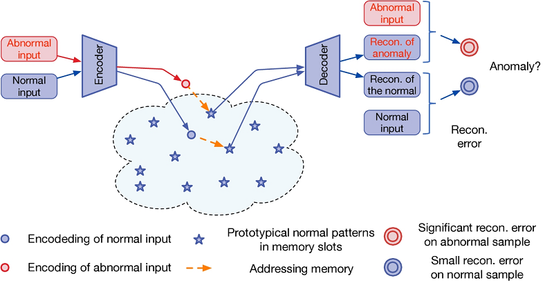

文中提到Autoencoder以及VAE 并不能有效的将异常图像恢复出正常图像，用存储器模块来增强自动编码器，并开发一种称为存储器增强自动编码器的改进的自动编码器，即MemAEMemAE首先从编码器获取编码，然后将其用作查询以检索用于重建的最相关的存储器项。在训练阶段，更新存储器内容并鼓励它们表示正常数据的原型元素。在测试阶段，学习的存储器将被固定，并且从正常数据的一些选定的存储器记录中获得重建。因此，重建将倾向于接近正常样本。

相似的工作 参见[Memory Augmented Generative Adversarial Networks for Anomaly Detection](http://arxiv.org/pdf/2002.02669v1.pdf)

[History-based Anomaly Detector: an Adversarial Approach to Anomaly Detection](http://arxiv.org/pdf/1912.11843v1.pdf)

4、尝试基于MMD学习异常scores，比较硬核。参见[Anomaly scores for generative models](http://arxiv.org/pdf/1905.11890v1.pdf)

5、尝试基于图像视觉思想解决问题，可以从ChangeDetection+self supervised learning+transfer learning考虑。

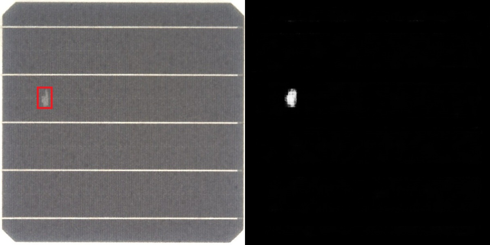

6、基于图像修复方法进行

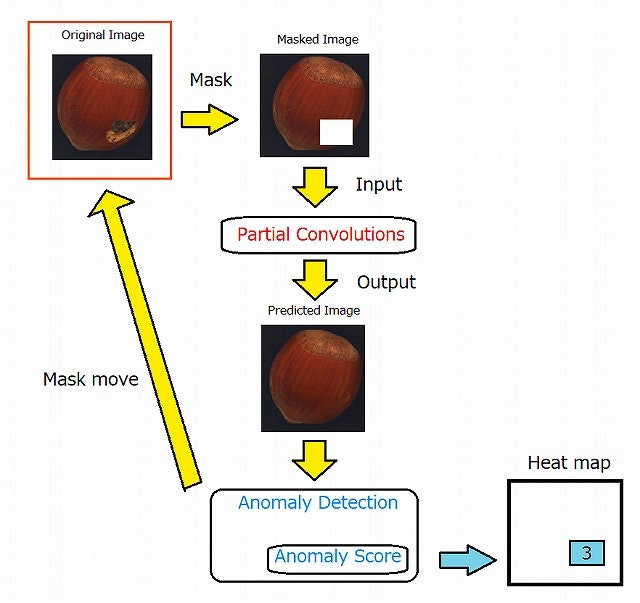

* 提前了解正常图像的异常检测。
* 另外，用普通图像训练部分卷积。
* 遮罩原始图像（蒙版图像）。
* 将其输入到部分卷积中，以获得与蒙版部分互补的图像（预测图像）。
* 对所获取的图像执行异常检测以获得异常得分（Anomaly Score）。
* 最后，将获得的异常分数代入热图（热图）的掩盖部分。
* 移动遮罩并重复该过程。

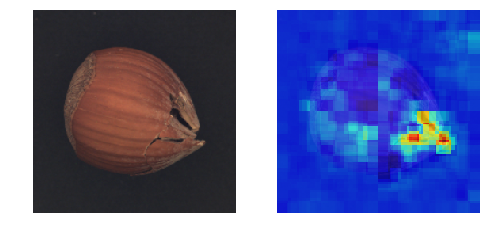
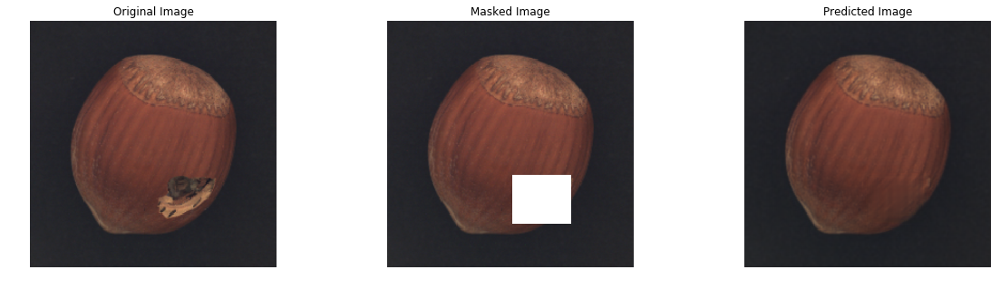
